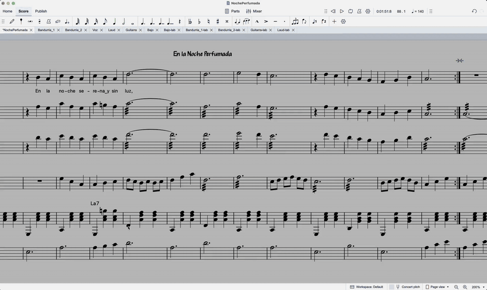
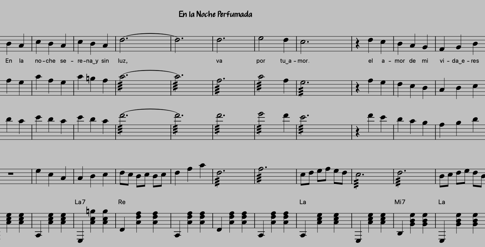

# Extractor de Letras y Acordes

Extension de MuseScore 4 que extrae letras con acordes alineados de partituras, generando texto plano y PDF para cancioneros, hojas de ensayo y cartas de acordes. Tambien disponible como CLI de Node.js.


## Instalacion

1. Descargar `lyrics-extractor.mext` de la [ultima release](https://github.com/manolo/lyrics-extractor/releases/latest)
2. Arrastrar el archivo `.mext` sobre MuseScore 4 (o hacer doble click)
3. La extension aparece en la barra de herramientas y en **Extensiones**

## Funcionalidades



### Verificacion de la partitura
Al abrir el plugin, analiza la partitura y muestra un indicador de estado:
- **Verde**: la partitura esta correcta, lista para extraer
- **Naranja**: problemas detectados con conteo especifico (sinalefas, guiones, cadenas silabicas, sincronizacion de acordes)

El boton **Corregir** arregla todos los problemas automaticamente:
- Formatea sinalefas: punto entre vocales (da.es -> da&#x203F;es)
- Elimina guiones manuales de las silabas
- Repara cadenas silabicas rotas (begin/middle/end)
- Sincroniza acordes del pentagrama principal a pentagramas enlazados (tab)

### Extraccion de letras y acordes
- Extrae letras con simbolos de acorde alineados sobre las silabas correspondientes
- Maneja repeticiones, voltas, D.S., D.C., Coda, Fine
- Expande secciones multi-verso (verso 0, verso 1, etc.)
- Abrevia secciones repetidas con "..." o etiquetas de seccion
- Detecta textos de sistema (INTRO, SOLISTA, ESTRIBILLO) y guias de ensayo como marcadores de seccion
- Los nombres de acordes siguen la ortografia de la partitura (solfeo o anglo), sin conversion manual
- Funciona desde cualquier pestana, incluyendo vistas de excerpt/particella (usa masterScore automaticamente)

### Modo solo acordes
Para partituras sin letras (instrumentales), el plugin muestra automaticamente la progresion de acordes estructurada por secciones, barlines y marcas de repeticion.

### Diagramas de trastes
Extrae diagramas de trastes desde frames FBox (incluyendo excerpts de guitarra) y los renderiza graficamente en la cabecera del PDF. En MuseScore 4.7+, los diagramas y nombres de acordes se leen directamente via la API nativa de QML. En versiones anteriores, un fallback extrae los datos del archivo .mscz en disco.

### Salida PDF
- Layout compacto optimizado para impresion (A4, margenes seguros)
- Acordes en verde, letras en negro, alineacion monoespaciada
- Opcional: ajustar a una pagina, numeros de linea, cabecera de grupo
- Diagramas de trastes en la cabecera con cejillas, marcadores y numeros de traste
- Abrir el archivo generado directamente desde el plugin

### Controles del plugin

| Control | Descripcion |
|---------|-------------|
| **Corregir** | Corregir sinalefas, guiones, cadenas silabicas, sincronizar acordes |
| **Extraer** | Extraer letras con acordes, mostrar vista previa |
| **Copiar** | Copiar texto extraido al portapapeles |
| **Guardar** (texto) | Guardar archivo de texto junto a la partitura y abrirlo |
| **Debug** | Exportar datos crudos como JSON |

### Ajustes (persistentes)

| Ajuste | Descripcion |
|--------|-------------|
| Solfeo | Convierte nombres de acordes a solfeo (Do, Re, Mi) o anglo (C, D, E) |
| Repetir todo | Expandir todas las repeticiones D.S./D.C. aunque no haya nuevas letras |

### Opciones PDF (visibles tras la extraccion)

| Opcion | Descripcion |
|--------|-------------|
| Pie de pagina | Nombre del grupo/agrupacion mostrado al pie de la ultima pagina |
| Condensar en 1 pagina | Reducir para que quepa en una pagina (gaps, margenes, fuente) |
| Num. linea | Numeros secuenciales en lineas de letra |
| Sin diagramas de acordes | Omitir diagramas de trastes de la cabecera |
| **Guardar** (PDF) | Guardar PDF junto a la partitura y abrirlo |

## Escribir letras para mejores resultados



### Introducir letras en MuseScore

| Accion | Atajo | Efecto |
|--------|-------|--------|
| Modo letras | `Cmd+L` | Empezar a escribir letras en la nota seleccionada |
| Siguiente nota (misma palabra) | `-` (guion) | Avanzar dentro de la misma palabra |
| Siguiente nota (nueva palabra) | `Espacio` | Completar la palabra y avanzar |
| Sinalefa (union de vocales) | `.` entre letras | `da.es` se muestra como `da es` |
| Simbolo de acorde | `Cmd+K` | Agregar un simbolo de acorde sobre el pentagrama |
| Texto de sistema | `Cmd+Shift+T` | Agregar etiqueta de seccion (Intro, Estrofa, etc.) |

### Saltos de linea y puntuacion

| En la partitura | Tras Corregir | Salida | Salto de linea? |
|----------------|---------------|--------|-----------------|
| `;` (punto y coma) | `,` (coma fullwidth) | `,` | SI |
| `,,` (doble coma) | `,` (coma pequena) | `,` | NO |
| `..` (doble punto) | `.` (punto pequeno) | `.` | NO |
| `...` (triple punto) | `...` (elipsis) | `...` | NO |
| `.` `!` `?` (simple) | sin cambio | sin cambio | SI |

Los saltos automaticos se disparan por puntuacion final de frase, silencios largos (>= 4 tiempos) y barlines de seccion. En caso de duda, el extractor NO rompe. Usa `;` para forzar un salto.

### Etiquetas de seccion

Agregar Texto de Sistema (`Cmd+Shift+T`) para marcar secciones. Las etiquetas controlan la estructura de la salida:
- **Con etiquetas:** los cortes ocurren solo en los limites de etiqueta
- **Una etiqueta en `|: :|`:** aparece una vez (misma seccion en ambas pasadas)
- **Varias etiquetas en `|: :|`:** todas se re-emiten en cada pasada
- **Etiquetas numeradas:** usar `#` (ej: `Estrofa #`) para `ESTROFA 1`, `ESTROFA 2`

### Numeracion de versos

Para canciones con barras de repeticion y letras diferentes por pasada, usar la funcion de numero de verso de MuseScore (verso 0, verso 1). El extractor expande las repeticiones con el verso correcto para cada pasada.

### Simbolos de acorde

Agregar acordes (`Cmd+K`) en cualquier pentagrama. El extractor detecta automaticamente el pentagrama con mas simbolos de acorde. Los pentagramas enlazados/tab y ocultos se excluyen automaticamente. Los nombres de acorde usan la ortografia de la partitura (Formato > Estilo > Simbolos de acorde).

## Uso por linea de comandos (CLI)

El mismo motor de extraccion esta disponible como CLI de Node.js (sin dependencias adicionales).

```bash
node cli/index.js cancion.mscz                              # stdout
node cli/index.js cancion.mscz --save                       # guardar txt
node cli/index.js cancion.mscz --pdf --header "Mi Tuna"     # generar PDF
node cli/index.js cancion.mscz --pdf --single --numbers     # PDF, 1 pagina, numerado
node cli/index.js cancion.mscz --chords-only                # solo progresion de acordes
```

### Flags del CLI

| Flag | Descripcion |
|------|-------------|
| `--save` | Guardar como `<partitura>-letra.txt` junto al .mscz |
| `--pdf` | Generar PDF como `<partitura>-letra.pdf` |
| `--single` | Ajustar PDF a una pagina |
| `--header <nombre>` | Nombre del grupo para cabecera PDF |
| `--numbers` | Numeros de linea en PDF |
| `--no-diagrams` | Omitir diagramas de trastes del PDF |
| `--chords-only` | Forzar modo solo acordes (ignorar letras) |
| `--anglo` | Forzar nombres de acorde anglo (C, D, E) |
| `--solfeo` | Forzar nombres de acorde solfeo (Do, Re, Mi) |
| `--full` | Expandir todas las repeticiones D.S./D.C. |
| `--debug` | Exportar datos crudos como JSON |

Por defecto, los nombres de acorde usan la ortografia de la partitura. Usar `--anglo` o `--solfeo` para forzar.

## Instalacion manual

| SO | Ruta |
|----|------|
| macOS | `~/Library/Application Support/MuseScore/MuseScore4/extensions/lyrics-extractor/` |
| Linux | `~/.local/share/MuseScore/MuseScore4/extensions/lyrics-extractor/` |
| Windows | `%LOCALAPPDATA%\MuseScore\MuseScore4\extensions\lyrics-extractor\` |

## Tests

```bash
node --test test/*.test.js
```

295 tests cubriendo extractores, formateo, repeticiones, navegacion, salida PDF, modo solo acordes, deteccion de ortografia, diagramas de trastes, API nativa e integracion.

## Licencia

Copyright 2025 Manolo Carrasco (do2tis)
