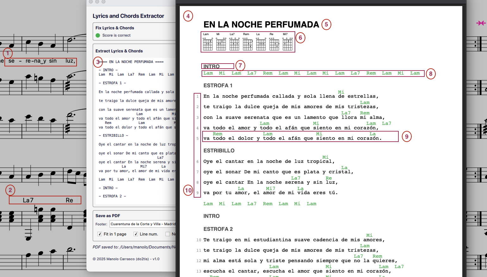

# Lyrics and Chords Extractor

[Leer en Espanol](README.es.md)

MuseScore 4 extension that extracts lyrics with aligned chords from scores, generating text and PDF output for songbooks, rehearsal sheets, and chord charts. Also available as a Node.js CLI.



**Legend:**

| # | Source / Output | Description |
|---|-----------------|-------------|
| 1 | Score | Lyrics on the melody staff (one syllable per note) |
| 2 | Score | Chord symbols on the accompaniment staff |
| 3 | Plugin | Extracted text preview with chords aligned over syllables |
| 4 | PDF | Generated PDF, ready to print or share |
| 5 | PDF | Song title rendered in large bold type |
| 6 | PDF | Fretboard diagrams for every unique chord used in the song |
| 7 | PDF | Section labels from rehearsal marks and system text (INTRO, ESTROFA, ESTRIBILLO) |
| 8 | PDF | Chord progression for instrumental sections (intro, interludes, outro) |
| 9 | PDF | Lyrics with each chord positioned exactly above the syllable where it changes |
| 10 | PDF | Optional sequential line numbers for easy rehearsal references |

## Installation

1. Download `lyrics-extractor.mext` from the [latest release](https://github.com/manolo/lyrics-extractor/releases/latest)
2. Drag the `.mext` file onto MuseScore 4 (or double click it)
3. The extension appears in the toolbar and under **Extensions**

## Features


The demo above shows a complete workflow: chord symbols are entered on the accompaniment staff, lyrics are typed on the voice staff using MuseScore's standard input (`.` for synalepha between vowels, `Space` to advance to the next word, `-` to split a word across notes, and punctuation like `,` `.` `;` to mark phrase boundaries). Once the score is ready, the plugin is launched, lyrics and chords are extracted with one click, and the formatted PDF is saved and opened automatically.

### Score health check
When the plugin opens, it analyzes the score and shows a status indicator:
- **Green**: score is correct, ready to extract
- **Orange**: issues detected with specific counts (synalepha, hyphens, syllabic chains, chord sync)

The **Fix** button corrects all issues automatically:
- Formats synalepha dots between vowels (da.es -> da&#x203F;es)
- Removes manual hyphens from syllables
- Repairs broken syllabic chains (begin/middle/end)
- Syncs chords from the principal staff of a part to the rest of its staves, typically its tablature copy
- Syncs VBox text fields (title, subtitle, composer, lyricist) to project properties

### Lyrics and chords extraction
- Extracts lyrics with chord symbols aligned above the corresponding syllables
- Handles repeats, voltas, D.S., D.C., Coda, Fine
- Expands multi-verse sections (verse 0, verse 1, etc.)
- Abbreviates repeated sections with "..." or section labels
- Detects system text labels (INTRO, SOLISTA, ESTRIBILLO) and rehearsal marks as section markers (auto-deduplicates when present on multiple staves). A rehearsal mark whose text is the number of its own measure is skipped: MuseScore names marks that way for rehearsal references, so they mark bars rather than sections
- Chord names follow the score's spelling setting (solfeo or anglo), no manual conversion needed
- Works from any tab, including excerpt/part views (uses masterScore automatically)

### Chord-only mode
For scores without lyrics (instrumentals), the plugin automatically shows the chord progression structured by sections, barlines, and repeat markers.

### Fretboard diagrams
Extracts chord fretboard diagrams from FBox frames (including guitar excerpts) and renders them graphically in the PDF header. Where the QML API exposes `FretDiagram`, diagrams and chord names are read straight from the score in memory. No 4.7.x release exposes it (the class reaches `api/v1/elements.h` after the 4.7 branch point), so on those builds a fallback reads the data from the `.mscz` file on disk and the plugin asks for the directory it lives in. The CLI always reads the file directly and needs neither.

### PDF output
- Compact layout optimized for printing (A4, safe margins)
- Chords in green, lyrics in black, monospace alignment
- Optional: auto-fit to one page, line numbers, header, footer
- Fretboard diagrams in header with barres, markers, and fret numbers
- Open generated file directly from the plugin

### Plugin controls

| Control | Description |
|---------|-------------|
| **Fix** | Correct synalepha, hyphens, syllabic chains, chord sync |
| **Extract** | Extract lyrics with chords, show preview |
| **Copy** | Copy extracted text to clipboard |
| **Save** (text) | Save text file alongside the score and open it |
| **Debug** | Export raw data as JSON |

### Settings (persisted)

| Setting | Description |
|---------|-------------|
| Solfeo | Convert chord names to solfeo (Do, Re, Mi) or anglo (C, D, E) |
| Full repeat | Expand all D.S./D.C. repeats even without new lyrics |

### PDF options (visible after extraction)

| Option | Description |
|--------|-------------|
| Header | Right-aligned text on every PDF page (e.g. group name) |
| Footer | Centered text at the bottom of every page |
| Fit in 1 page | Auto-fit to one page (reduces gaps first, then font size) |
| Line numbers | Sequential numbers on lyric lines |
| No chord diagrams | Omit fretboard diagrams from the header |
| **Save** (PDF) | Save PDF alongside the score and open it |

## Writing lyrics for best results

### Entering lyrics in MuseScore

| Action | Shortcut | Effect |
|--------|----------|--------|
| Enter lyrics mode | `Cmd+L` | Start typing lyrics on the selected note |
| Next note (same word) | `-` (hyphen) | Advance within the same word |
| Next note (new word) | `Space` | Complete the word and move on |
| Synalepha (vowel linking) | `.` between letters | `da.es` renders as `da es` |
| Add chord symbol | `Cmd+K` | Add a chord symbol above the staff |
| Add system text | `Cmd+Shift+T` | Add a section label (Intro, Estrofa, etc.) |

### Line breaks and punctuation

The extractor splits lyrics into lines automatically based on punctuation, musical rests, section barlines, and line length. For best results, add explicit markers in the score:

| In the score | After Fix | Output | Line break? |
|-------------|-----------|--------|-------------|
| `;` (semicolon) | `,` (fullwidth comma) | `,` | YES (recommended) |
| `.` `!` `?` (single) | unchanged | unchanged | YES |
| `,,` (double comma) | `,` (small comma) | `,` | NO (continuation) |
| `..` (double period) | `.` (small full stop) | `.` | NO (continuation) |
| `...` (triple period) | `...` (ellipsis) | `...` | NO (continuation) |

**Automatic line splitting:** When lyrics lack explicit break markers, the extractor splits long lines at commas near the median verse length, at musical rest boundaries, and at double barlines. Lines that exceed the PDF page width (75 characters) are split at the best available pause, even if short.

**Tips for optimal results:**
- Use `;` (semicolon) in the lyrics to force a line break at any point. The Fix button converts it to a visually distinct fullwidth comma in the score, and it renders as a normal `,` in the output.
- Add **double barlines** between sections (Solista, Estribillo) to mark structural boundaries.
- Add **System Text** labels (`Cmd+Shift+T`) for section names. These control stanza breaks and label emission.
- Without any of the above, the extractor relies on heuristics (punctuation, rests, line length) which may produce suboptimal results on scores with long unbroken phrases.

### Section labels

Add System Text (`Cmd+Shift+T`) to mark sections. Labels control the output structure:
- **With labels:** breaks occur only at label boundaries
- **Single label in `|: :|`:** appears once (same section both passes)
- **Multiple labels in `|: :|`:** all re-emit on each pass
- **Numbered labels:** use `#` (e.g. `Estrofa #`) for `ESTROFA 1`, `ESTROFA 2`
- **Explicit sequence:** use `:` to list values (e.g. `Solista manolo:juan:pedro` produces `SOLISTA MANOLO`, `SOLISTA JUAN`, `SOLISTA PEDRO`). Works with numbers: `Estrofa 1:2`. Empty items between separators are ignored (`Estrofa 1::2::` = `Estrofa 1:2`). When the sequence is exhausted, the label is suppressed entirely

### Verse numbering

For songs with repeat bars and different lyrics per pass, use MuseScore's verse number feature (verse 0, verse 1). The extractor expands repeats with the correct verse for each pass.

### Chord symbols

Add chords (`Cmd+K`) to any staff. The extractor auto-detects the staff with the most chord symbols. Linked/tab staves and hidden staves are excluded automatically. Chord names use the score's spelling setting (Format > Style > Chord Symbols).

### Title detection

The plugin resolves the song title in this order:
1. **Project properties** (File > Project Properties > Title)
2. **VBox title** (the title text element in the score's top frame)
3. **File name** (derived from the .mscz file name, splitting camelCase/hyphens)

The **Fix** button also syncs VBox text fields (title, subtitle, composer, lyricist) to the project properties, so both stay in sync.

## CLI Usage

The same extraction engine is available as a Node.js CLI (no additional dependencies).

```bash
node cli/index.js song.mscz                          # stdout
node cli/index.js song.mscz --save                   # save text file
node cli/index.js song.mscz --pdf --header "My Band" # PDF with header
node cli/index.js song.mscz --pdf --footer "My Band" # PDF with footer
node cli/index.js song.mscz --pdf --single --numbers  # PDF, one page, numbered
node cli/index.js song.mscz --chords-only             # chord progression only
```

### CLI Flags

| Flag | Description |
|------|-------------|
| `--save` | Save to `<score>-letra.txt` alongside the score |
| `--pdf` | Generate PDF to `<score>-letra.pdf` |
| `--single` | Shrink PDF to fit on one page |
| `--header <name>` | Right-aligned header on every PDF page |
| `--footer <name>` | Centered footer on last PDF page |
| `--numbers` | Add line numbers in PDF |
| `--no-diagrams` | Omit fretboard diagrams from PDF |
| `--chords-only` | Force chord-only mode (ignore lyrics) |
| `--lyrics-only` | Output lyrics without chord lines above |
| `--chordpro` | Export as ChordPro format (.cho) |
| `--no-annotations` | Omit staff text and expressions from the chord line |
| `--orphan-lyrics` | Print lyric verses that no pass of the score sings |
| `--staff <name\|num>` | Extract lyrics from a specific staff (by index or instrument name) |
| `--anglo` | Force anglo chord names (C, D, E) |
| `--solfeo` | Force solfeo chord names (Do, Re, Mi) |
| `--full` | Write all D.S./D.C. repeats |
| `--check` | Check lyrics for issues (synalepha, hyphens, syllabic) |
| `--fix` | Fix lyrics issues, sync chords, sync VBox to project properties |
| `--debug` | Export raw extracted data as JSON |

By default, chord names use the score's own spelling setting. Use `--anglo` or `--solfeo` to override.

## Manual installation

| OS | Path |
|----|------|
| macOS | `~/Library/Application Support/MuseScore/MuseScore4/extensions/lyrics-extractor/` |
| Linux | `~/.local/share/MuseScore/MuseScore4/extensions/lyrics-extractor/` |
| Windows | `%LOCALAPPDATA%\MuseScore\MuseScore4\extensions\lyrics-extractor\` |

## Repository layout

```
lib/     transforms extracted data into text, PDF and ChordPro. Shared by the dialog
         and the CLI, and depends on nothing else in the tree
score/   reads a MuseScore score, and writes back into it, one module per direction
         and per source: api-extractor.js reads the score open in MuseScore through the
         QML API and api-patcher.js writes into it, which is what the Fix button does,
         while xml-extractor.js reads the XML of a .mscz and xml-patcher.js writes into
         it for the CLI. mscz-reader.js unzips the file, and fallback-runner.js runs the
         CLI when the plugin API cannot give the fret diagrams
cli/     the two entry points: index.js for the command line, and extract-chords.js,
         which the dialog spawns for that fallback
ui/      the dialog itself and its help text
test/    unit suites, plus test/its/ for the snapshot ones
```

Dependencies run one way: `score/` and `cli/` reach into `lib/`, never the reverse. Every
`.js` outside `cli/` works in both the QML engine and Node, which is why the same
formatting code serves the dialog and the command line. Modules that need a sibling get it
through `require` in Node and through an injected reference in QML (`setTextUtils`,
`setLineBuilder`, `setConvertChord`), since QML has no `require`.

## Running tests

```bash
npm test          # same as: node --test test/*.test.js
npm run test:package  # build the package, then run the snapshot suite against its minified CLI
```

775 tests covering score readers, formatting, repeats, navigation, PDF output, chord-only mode, spelling detection, fretboard diagrams, native API detection, the disk fallback, score file lookup, element type classification, chord line layout, punctuation handling, lyrics fixing, XML patching, label emission on repeat passes, and integration.

The snapshot suites in `test/its/` compare CLI output against baseline `.txt` files. Most of the scores they read are frozen copies of real ones in `test/its/scores/`, kept out of git, so a song whose score is absent simply skips. Two are synthetic, written by the generators next to them, and those two **are** committed: `test_le_MultiVerso.mscz` and `test_le_MalaguenaMini.mscz`, 33K between them, which is what lets CI run their suites. The `.mscz` is the fixture of record and the generator is how it is edited, with `test/synthetic-scores.test.js` failing if the two drift apart. Baselines are reviewed by hand: never regenerate one without checking whether the score itself changed (each baseline stores the `.mscz` mtime in a trailing comment).

`npm run test:package` is the run that matters before a release: it minifies, then drives that same snapshot suite through the **packaged** CLI over all 21 scores, so a minification that changes any output fails. On CI only the committed fixture and the two synthetic scores exist, so it covers 14 of those tests there, and the release workflow uses it as its gate before publishing the `.mext`.

## Building the .mext package

```bash
npm install --ignore-scripts   # once, for terser
npm run build                  # dev build
node build.js 1.6.1            # versioned build
node build.js dev --no-minify  # sources verbatim, to bisect a packaging problem
npm run install-local          # build and copy into the local MuseScore extensions dir
```

File names and relative paths in the package are the ones in this tree, so the QML imports resolve there exactly as they do here. Only runtime files are included (no tests or documentation).

The JavaScript is minified: comments and whitespace go and expressions are compressed, which takes the package from 156K to 103K. Identifiers are **not** mangled. That is deliberate: mangling once cost two shipping bugs, it makes the stack trace in a `console.log` only environment useless, and it would save just 9K more. `test/minify.test.js` holds those options in place by checking that the minified modules keep every export and every name the dialog calls. Read this repository for the sources, not the package.

The release workflow (`release.yml`) runs tests and then calls `build.js` with the version from the git tag.

## License

GNU General Public License, version 3 or later, see [LICENSE](LICENSE). Copyright (C) 2026 Manolo Carrasco (do2tis)
